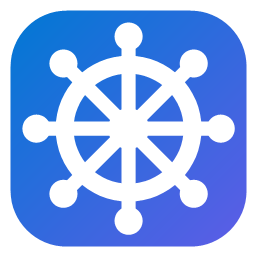

<div align="center">



# Helm

**A personal productivity toolkit for Windows and Android, in the spirit of Microsoft PowerToys.**

Notes, tasks, a password vault, a command palette and tools for Claude Code in one Fluent app, synced end-to-end encrypted between your PC and your phone.

[](https://github.com/huyhung1404/helm/releases/latest)
[](https://github.com/huyhung1404/helm/actions/workflows/ci.yml)
[](LICENSE)


[Download](https://github.com/huyhung1404/helm/releases/latest) · [Changelog](CHANGELOG.md) · [Documentation](#documentation) · [Report a bug](https://github.com/huyhung1404/helm/issues/new/choose)

</div>

## Highlights

- **One app, many tools.** Each tool is an independent module with its own page, Home tile and tray toggle. Turn on only what you use.
- **PC and Android.** The same Home and General pages on both, and every tool runs on the platforms it is built for.
- **Local-first, end-to-end encrypted sync.** Every device keeps a full copy of your data; the sync server only ever sees encrypted records.
- **Updates itself.** New versions download in the background from GitHub Releases and install when you choose.
- **Keyboard-first.** Alt+Space for the command palette, Win+Alt+N to capture a note or task from any app.
- **Helm tools for AI agents (MCP).** Claude Code, VS Code, Claude Desktop, Cursor or any MCP client can read and write your notes, Tracker and Missions through Helm's MCP server (`Helm.exe --mcp`); turn it on in **AI & MCP**.

## Tools

| Tool | Platforms | What it does |
|---|---|---|
| Command Palette | PC | Alt+Space: one search box, Helm first (notes, tasks, vault items while unlocked, settings), then Windows: apps, files, open windows, Windows Settings, the web |
| Missions | PC + Android | Reach a goal one step at a time: describe it, copy the prompt Helm writes into any AI and import the roadmap it answers (or ask Claude Code, through Helm's tools for Claude); steps are done in order, each with its start and finish dates; the pace against the plan and the deadline; celebrations and the rewards you chose; re-plan the rest with an AI when you fall behind; a daily step reminder; share an AI's answer to Helm on the phone; badges; linked notes; an Android home-screen widget; a Today card; send a step to Tracker; statistics and CSV; ready-made missions ([design](docs/missions-design.md)) |
| Notes | PC + Android | Notes that save as you type and sync end-to-end encrypted; a note edited on two devices keeps both versions; 30-day trash; Markdown export; notes link to tasks, people in the debt book and missions |
| Quick Capture | PC + Android | Save a note, task or debt from anywhere: Win+Alt+N on PC, Share → "Save to Helm" or a Quick Settings tile on Android, with short forms like `/t buy milk tomorrow 9h` |
| SSH | PC + Android | A terminal on your servers: sign in with an Ed25519 key Helm makes for this device (encrypted for your Windows account, never synced) or a password that is never saved; server keys are pinned on first use and a changed key is refused; *Install this device's key* adds the key to a server like ssh-copy-id; *Import from SSH config* brings your ssh servers, key files and known server keys in one click; a password or key can come from Vault; sessions keep running while you use the rest of Helm; on the phone a key bar adds Ctrl, Esc, Tab and arrows |
| Tracker | PC + Android | To-do lists in workspaces, synced across devices; completions are logged with their start and finish times for reports and CSV export; a month/week calendar (with the debts due) and .ics export; linked notes; Android has a home-screen widget |
| Wallet | PC + Android | Track your spending: the phone reads Techcombank's and ACB's balance notifications (app or SMS) and saves each transaction; give it a category with one tap (or from the notification; repeat descriptions file themselves); categories with icons and colours; charts of the month's cash flow, spending by category and by day, the budget, and the last 6 months; cash added by hand or with `/s 50k coffee`; a debt book (who owes whom, repayments, due dates, `/d Nam 200k`) that a transfer can go into, so lending is not counted as spending; synced across devices; an Android home-screen widget with the balance and the period's spending and income; CSV |
| Scratch | PC + Android | One synced place for photos, videos, files and text: Share → *Helm Scratch* on the phone, drop or paste (Ctrl+V) on PC, take them out anywhere (open, copy, save, share); end-to-end encrypted, with a trash. *Send to clipboard* copies a thing onto every device's clipboard at once |
| Watch Later | PC + Android | Save YouTube and Facebook videos, Shorts and Reels to watch later (Share → "Save to Helm" on the phone, paste or drop a link on PC), synced across devices; titles, channels, lengths and thumbnails are filled in by themselves; download on PC with yt-dlp in the quality you pick, or tap *Download on PC* on the phone |
| Vault | PC + Android | Passwords, secure notes, cards, identities and documents, end-to-end encrypted, synced, and backed up to a folder you choose; two-factor codes (TOTP); autofill on Android and auto-type (Ctrl+Alt+A) on PC ([guide](docs/vault-guide.md), [design](docs/vault-design.md), [format](docs/vault-format.md)) |

More tools are planned (see [Roadmap](#roadmap)). Always On Top is built but not registered; it comes back with one line in `src/Helm.App/Hosting/HelmModules.cs`. The previous Zones module is kept in git history (tag `v0.3.0`).

## Install

### Windows

Requires Windows 10 (19041) or Windows 11, x64.

1. Download **`Helm-win-Setup.exe`** from the [latest release](https://github.com/huyhung1404/helm/releases/latest) and run it.
2. Setup installs per user into `%LOCALAPPDATA%\HelmApp` (no admin needed to install), creates Start menu and desktop shortcuts, and installs the .NET 8 Desktop Runtime if it is missing.
3. When Helm starts, it asks once for administrator rights (UAC), so its hotkeys and hooks also work over elevated windows.

Settings live separately in `%LOCALAPPDATA%\Helm`, so they survive an uninstall and reinstall. To remove them with the app, turn on General → Updates → *Delete my settings when Helm is uninstalled*.

### Android

Requires Android 8.0 or newer.

Download **`Helm-android.apk`** from the same release and open it; Android asks you to allow installs from your browser or file manager once. Helm then updates itself from GitHub (General → Updates), asking before each install.

## Updates

Updates are automatic. Helm checks GitHub Releases shortly after it starts and then every 6 hours, downloads new versions in the background and tells you with a tray notification and the Home tile. Nothing is installed until you choose **Restart to update**, in General → Updates or from the tray menu.

- **Manual check**: General → Updates → *Check for updates*.
- **Channels**: *Stable* (default) or *Preview*, which receives GitHub pre-releases such as `v0.4.0-preview.1`.
- **Auto-install**: turn on *Install updates automatically when Helm restarts*.

Portable and development builds do not auto-update.

## Sync and privacy

Helm is local-first: every tool reads and writes a replica on the device, and sync runs in the background. Data is encrypted on the device before it leaves it, so the sync server stores only opaque, encrypted records and cannot read your notes, tasks or vault. Vault backups written to your own folder are encrypted too, and `helm-vault-restore` opens them without Helm.

Sync accounts are invite-only. Everything else in Helm works without an account. The protocol and the encryption are documented in [docs/sync-protocol.md](docs/sync-protocol.md) and [docs/vault-design.md](docs/vault-design.md).

## Documentation

| Document | For |
|---|---|
| [Vault guide](docs/vault-guide.md) (Vietnamese) | Using the vault: setup, daily use, unlocking, backups, recovery |
| [Vault design](docs/vault-design.md) · [Vault format](docs/vault-format.md) | How the vault is encrypted, and its on-disk and backup format |
| [Sync protocol](docs/sync-protocol.md) | How devices stay in step, the server, invites and tokens |
| [Development](docs/development.md) | Building, running, solution layout, adding a module, releasing |
| [Android](docs/android.md) | The Android app: shared code, tools per platform, testing, signing |
| [Testing updates](docs/testing-updates.md) | End-to-end manual test for install → update → restart |
| [New tool prompt](docs/new-tool-prompt.md) | Every rule a new tool follows, ready to paste into Claude Code |

## Building from source

Requirements: Windows 10 19041+ / Windows 11 and the .NET 8 SDK or newer.

```powershell
dotnet build
dotnet test
dotnet run --project src/Helm.App
```

`dotnet run` shows a UAC prompt because Helm runs as administrator; pass `--no-elevate` for quick UI checks. The Android app is built separately (see [docs/android.md](docs/android.md)). The full guide, including the architecture and how to add a tool, is in [docs/development.md](docs/development.md).

## Roadmap

Planned tools, each added as its own module (`src/Helm.Modules.<Name>`):

- **Window layouts (Zones, redesigned)**: custom zones, layouts across monitors, number shortcuts to switch layouts, cycling between windows in a zone. The v0.3.0 implementation is the starting point.
- **Always On Top**: already built; re-enable after a review.
- **System Tools**: Color Picker, Screen Ruler, Text Extractor (OCR), Awake.
- **Input & Output**: Keyboard Manager (remaps), Find My Mouse.
- **File Management**: File Locksmith, bulk rename, Hosts file editor, Environment Variables.
- **Advanced**: Unity helpers (kill stuck editors, clear Library caches).
- Code signing for the installer and binaries.

## Contributing

Bug reports and ideas are welcome in [Issues](https://github.com/huyhung1404/helm/issues/new/choose). Before opening a pull request, read [CONTRIBUTING.md](CONTRIBUTING.md).

## Security

Please do not report security problems in public issues. See [SECURITY.md](SECURITY.md) for how to report one privately.

## License

Helm is released under the [MIT License](LICENSE). Copyright (c) 2026 huyhung1404.
